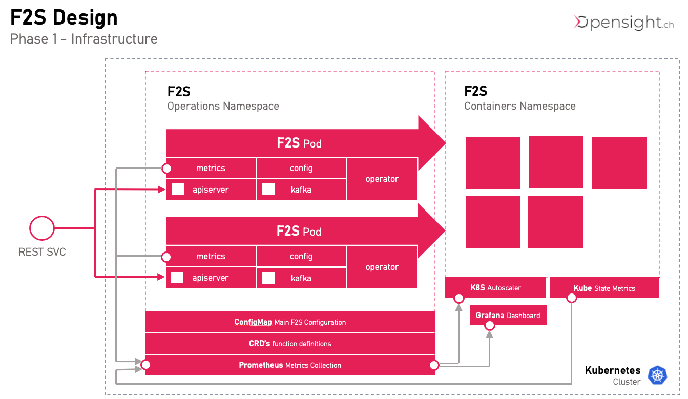
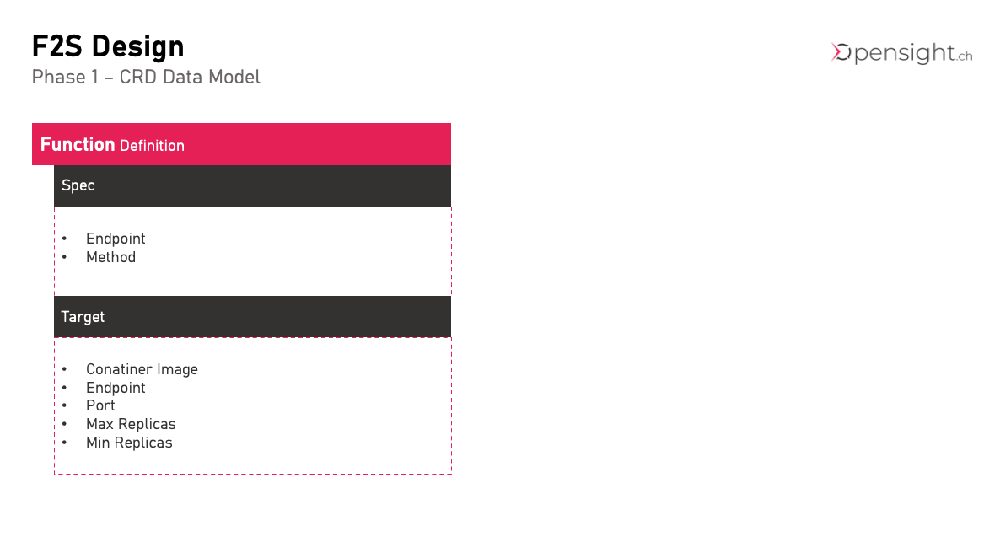

# F2S
An Open Source Function as a Service (FaaS) Platform

Status <font color=red>Early Alpha</font>

# Content
- [F2S](#f2s)
- [Content](#content)
- [Core Concept](#core-concept)
  - [KISS - Simple and Stupid](#kiss---simple-and-stupid)
  - [All Features included](#all-features-included)
- [Architecture](#architecture)
  - [Namespaces](#namespaces)
  - [Gitops (CRDs Config)](#gitops-crds-config)
  - [High Availability](#high-availability)
  - [Autoscaling](#autoscaling)
- [Configuration](#configuration)
  - [CRDs functions.f2s.opensight.ch](#crds-functionsf2sopensightch)
  - [Configmap - config.yaml](#configmap---configyaml)
# Core Concept
Personally, I work on the project mainly to learn more Golang and because I have a usecase for a F2S Platform currently.

These will be the core concepts of this F2S Platform
## KISS - Simple and Stupid

* Keep it as simple as can be
* Run out of the box with as few dependencies as possible. <br/>
  No service meshes or other dependencies
* Simple start. Up and running in default config in 1 minute
* Lightweight. Use the features of vanilla kubernetes where ever possible
* Intuitive. No steep learning curve<br/>
  Beginners can use a UI to manage the soultion (i.e. create the CRD’s using the UI)

## All Features included

* No "enterprise only" features
* <font color=orange>TO DO</font> Kafka Message Bus Integration
* <font color=orange>TO DO</font> Scale to Zero
* <font color=orange>TO DO</font> Security (OAuth)
# Architecture
This is a first draft of the architecture and can still change.



* **API Server**<br/>
  API Server is the REST API Interface. Functions can be defined and invoked via API
* **Metrics**<br/>
  F2S Exposes Metrics in order to be able to make scaling decisions and have insight in all activity
* **Config**<br/>
  The Config package observes CRD's (F2SFunction Declarations) in "f2s" namespace on kubernetes
* **Kafka**<br/>
  Package for Interaction with Kafka Event Bus (planned)
* **Operator**<br/>
  Operator reacts to Config Changes and creates or deletes deployments and services in f2s-containers namespace

## Namespaces
F2S uses 2 fixed namespaces in kubernetes
* **F2S**<br/>
contains the F2S operational components
* **F2S-Containers**<br/>
contains the running pods managed by F2S
## Gitops (CRDs Config)
F2SFunctions are managed by CRDs (bring your own Gitops)

## High Availability
We use a redundant setup of 2 F2S Pods. 

## Autoscaling
All Metrics go to the prometheus instance. The plan is to use it with autoscaler on k8s

# Configuration
## CRDs functions.f2s.opensight.ch
Initial Datamodel is for testing and will certainly change


## Configmap - config.yaml

```
# enable debug output
debug: true

prometheus:
  url: prometheus-service.f2s:9090
```