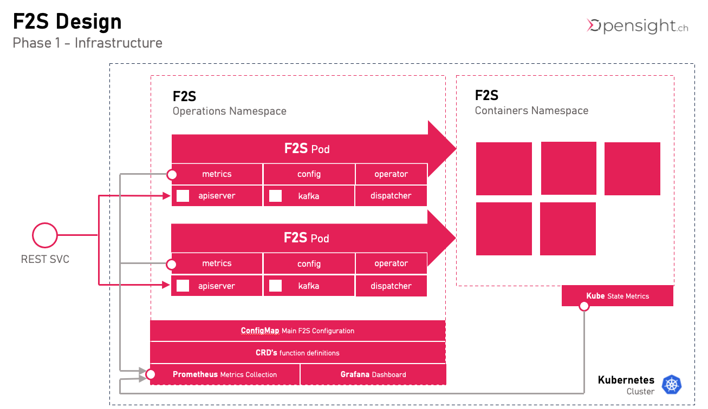

# F2S
[](https://opensource.org/licenses/MIT)
[](https://opensight.ch/licenses/MIT)
[](https://opensight.ch/licenses/MIT)

An Open Source Function as a Service (FaaS) Platform. <br />
[Get started in 5 Minutes](#quick-start-guide) on your Kubernetes platform.

## Features

* **Gitops**<br/>
  Define your Functions as K8S CRDs
* **Scale to Zero**<br/>
  Can scale Deployments to zero when there is no activity

# Content
- [F2S](#f2s)
  - [Features](#features)
- [Content](#content)
- [Quick Start Guide](#quick-start-guide)
- [Core Concept](#core-concept)
  - [All Features included](#all-features-included)
- [Architecture](#architecture)
  - [Namespaces](#namespaces)
  - [Gitops (CRDs Config)](#gitops-crds-config)
  - [High Availability](#high-availability)
  - [Autoscaling](#autoscaling)
- [Configuration](#configuration)
  - [CRDs functions.f2s.opensight.ch](#crds-functionsf2sopensightch)
  - [Configmap - config.yaml](#configmap---configyaml)

# Quick Start Guide
This will install f2s on your kubernetes cluster. 

* "Functions" CRD
* Namespaces "f2s", "f2s-containers"
* ClusterRoles and Bindings
* Deployments for F2S, Grafana, Prometheus
* Services

```
helm repo add f2s https://butschi84.github.io/F2S/helm-release
helm repo update

# install crds
kubectl apply -f https://butschi84.github.io/F2S/helm-release/crds/crds.yaml

# install f2s
helm install f2s f2s/f2s
```

# Core Concept

* Keep it as simple as can be
* Run out of the box with as few dependencies as possible. <br/>
  No service meshes or other dependencies
* Simple start. Up and running in default config in 1 minute
* Lightweight. Use the features of vanilla kubernetes where ever possible
* Intuitive. No steep learning curve<br/>
  Beginners can use a UI to manage the soultion (i.e. create the CRD’s using the UI)

## All Features included

* No "enterprise only" features
* <font color=orange>TO DO</font> Kafka Message Bus Integration
* Scale to Zero
* <font color=orange>TO DO</font> Security (OAuth)
# Architecture
This is a first draft of the architecture and can still change.



* **API Server**<br/>
  API Server is the REST API Interface. Functions can be defined and invoked via API
* **Metrics**<br/>
  F2S Exposes Metrics in order to be able to make scaling decisions and have insight in all activity
* **Config**<br/>
  The Config package observes CRD's (F2SFunction Declarations) in "f2s" namespace on kubernetes
* **Kafka**<br/>
  Package for Interaction with Kafka Event Bus (planned)
* **Operator**<br/>
  Operator reacts to Config Changes and creates or deletes deployments and services in f2s-containers namespace

## Namespaces
F2S uses 2 fixed namespaces in kubernetes
* **F2S**<br/>
contains the F2S operational components
* **F2S-Containers**<br/>
contains the running pods managed by F2S
## Gitops (CRDs Config)
F2SFunctions are managed by CRDs (bring your own Gitops)

## High Availability
We use a redundant setup of 2 F2S Pods. 

## Autoscaling
All Metrics go to the prometheus instance. The plan is to use it with autoscaler on k8s

# Configuration
## CRDs functions.f2s.opensight.ch
Initial Datamodel is for testing and will certainly change


## Configmap - config.yaml

```
# enable debug output
debug: true

prometheus:
  url: prometheus-service.f2s:9090

f2s:
  timeouts:
    request_timeout: 120000
    http_timeout: 60000
    scaling_timeout: 45000
```

Environment Variables take precedence over the configmap and are useful for local testing / debugging.

```
export Prometheus_URL=localhost:9090
export KUBECONFIG=~/.kube/config
```